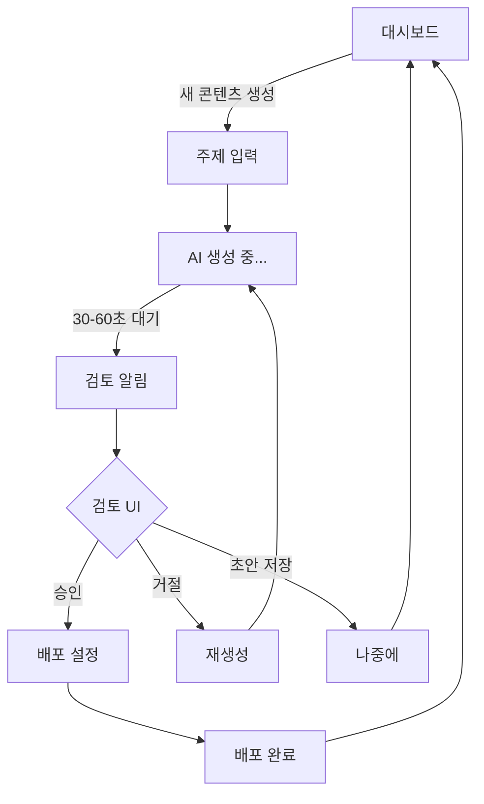

# ContentFlow AI - UX Design Specification

**생성일:** 2025-11-14
**작성자:** BMad
**버전:** 1.0
**상태:** Complete

---

## Executive Summary

ContentFlow AI는 한국 소상공인과 중소기업을 위한 AI 기반 콘텐츠 마케팅 자동화 플랫폼입니다. 이 UX Design Specification은 "내실있고 자연스러운 콘텐츠 자동 생성"이라는 핵심 가치를 사용자 경험으로 구현하는 방법을 정의합니다.

**핵심 UX 원칙:**

1. Zero Learning Curve - 5분 안에 첫 콘텐츠 생성
2. 실시간 피드백 - AI 작업 진행상황 즉시 표시
3. 한눈에 파악 - 대시보드에 모든 현황 표시
4. WYSIWYG 편집 - 직관적인 검토 UI
5. 깔끔한 집중 - 불필요한 요소 제거

---

## 1. 프로젝트 비전

### 1.1 프로젝트 이해

**프로젝트:** ContentFlow AI - 올인원 콘텐츠 마케팅 자동화 플랫폼

**핵심 가치 제안:**

> "AI가 콘텐츠를 만들지만, 내 브랜드의 목소리는 내가 지킨다"

**타겟 사용자:**

- 한국 소상공인 및 중소기업 (771만+ 사업체)
- 기술에 익숙하지 않은 일반 사용자
- 콘텐츠 생성의 어려움으로 SNS 마케팅을 효과적으로 활용하지 못하는 사업자
- 시간과 리소스가 부족한 소규모 팀

**핵심 경험:**

1. **Google Sheets에서 주제 기획** → 익숙한 도구 활용
2. **멀티 LLM이 최고 품질 콘텐츠 자동 생성** → GPT-4, Claude 3.5, Gemini 2.0 동시 호출
3. **사업자가 검토 후 승인** → 통제권 유지
4. **모든 SNS 채널에 자동 배포** → Instagram, Facebook, 네이버 블로그 등

**플랫폼:** 웹 애플리케이션

- 주요: 데스크톱 (콘텐츠 검토는 큰 화면이 유리)
- 지원: 태블릿, 모바일 (반응형 - 이동 중 빠른 승인)

### 1.2 감정적 목표

사용자가 ContentFlow AI를 사용할 때 느껴야 할 감정:

**1. 안심 & 신뢰 (Relief & Trust)**

- "AI가 만든 콘텐츠인데 정말 괜찮네?"
- "이 정도면 내 브랜드에 딱 맞아"
- 품질에 대한 불안감 → 신뢰로 전환

**2. 해방감 & 여유 (Liberation & Ease)**

- "드디어 콘텐츠 고민에서 벗어났다"
- "이제 마케팅이 부담스럽지 않네"
- 시간 부담 → 여유 확보

**3. 통제력 & 자신감 (Control & Confidence)**

- "내가 최종 결정권을 가지고 있어"
- "AI가 도와주지만, 내 브랜드는 내가 지킨다"
- 불안정 → 확실한 통제

**Aha Moment (PRD에서):**

> "처음 AI가 만든 콘텐츠를 봤는데, 수정할 게 거의 없어서 그냥 바로 게시했다"

---

## 2. 디자인 시스템 기반

### 2.1 디자인 시스템 선택

**시스템:** Shadcn/ui (PRD에서 이미 선택됨)

**선택 이유:**

- ✅ Next.js 15 + Tailwind CSS와 완벽한 통합
- ✅ 커스터마이징 용이 - 코드를 직접 소유
- ✅ 접근성 내장 - Radix UI 기반 WCAG AA 준수
- ✅ 한글 폰트 지원 - Pretendard와 잘 어울림
- ✅ 풍부한 컴포넌트 - 40+ 컴포넌트 제공
- ✅ 다크모드 지원 (Post-MVP)

**제공 컴포넌트:**

- Button, Input, Select, Checkbox, Radio
- Card, Dialog, Sheet, Popover, Tooltip
- Table, Calendar, Form, Toast
- Tabs, Accordion, Dropdown Menu
- Progress, Badge, Avatar

**커스터마이징 필요 컴포넌트:**

1. **콘텐츠 리뷰 카드** - 검토 대기 아이템 표시
2. **마크다운 에디터** - WYSIWYG 편집기
3. **진행상황 표시** - AI 생성 프로세스 시각화
4. **캘린더 뷰** - 월간 콘텐츠 계획

---

## 3. 시각적 기반 (Visual Foundation)

### 3.1 컬러 시스템

**선택된 테마:** Trust Blue (Theme 1)

**선택 이유:**

- ContentFlow AI의 핵심 가치인 "신뢰"와 "안정성"을 가장 잘 표현
- 한국 사용자들에게 익숙한 네이버, 카카오톡의 파란색 계열
- 다양한 업종에 중립적
- 전문성과 친근함을 동시에 전달
- AI 기술 플랫폼에 적합하면서도 소상공인에게 부담스럽지 않음

**컬러 팔레트:**

```
Primary: #0EA5E9 (Sky Blue)
- 주요 액션 버튼 (새 콘텐츠 생성, 승인, 배포)
- 활성 네비게이션
- 링크 및 강조 요소

Secondary: #06B6D4 (Cyan)
- 보조 액션 버튼
- 호버 상태
- 부가 정보 강조

Success: #10B981 (Green)
- 배포 완료 상태
- 승인 성공 알림
- 긍정적 피드백

Warning: #F59E0B (Amber)
- 검토 대기 상태
- 주의 필요 알림
- 할당량 80% 도달

Error: #EF4444 (Red)
- 실패 상태
- 에러 메시지
- 삭제/거절 액션

Neutral:
- Gray 900 (#0f172a) - 제목, 주요 텍스트
- Gray 700 (#334155) - 본문 텍스트
- Gray 500 (#64748b) - 보조 텍스트
- Gray 300 (#cbd5e1) - 테두리
- Gray 100 (#f1f5f9) - 배경
- Gray 50 (#f8fafc) - 카드 배경
```

**대안 테마 (업종별 커스터마이징):**

- Growth Green (#10B981) - 식품/뷰티
- Warm Coral (#F97316) - 카페/레스토랑
- Creative Purple (#8B5CF6) - 디자인/패션

**인터랙티브 시연:**

- [ux-color-themes.html](./ux-color-themes.html) - 4가지 컬러 테마 비교 및 실제 UI 컴포넌트

### 3.2 타이포그래피

**폰트 패밀리:**

```css
/* Primary Font - 한글 최적화 */
font-family:
  'Pretendard',
  -apple-system,
  BlinkMacSystemFont,
  system-ui,
  Roboto,
  sans-serif;

/* Monospace - 코드, 데이터 */
font-family: 'JetBrains Mono', 'Fira Code', Consolas, monospace;
```

**타입 스케일 (Tailwind CSS):**

```
H1: text-4xl (2.25rem / 36px) - 페이지 제목
H2: text-3xl (1.875rem / 30px) - 섹션 제목
H3: text-2xl (1.5rem / 24px) - 카드 제목
H4: text-xl (1.25rem / 20px) - 서브 섹션
H5: text-lg (1.125rem / 18px) - 리스트 아이템
Body: text-base (1rem / 16px) - 본문
Small: text-sm (0.875rem / 14px) - 보조 정보
Tiny: text-xs (0.75rem / 12px) - 라벨, 뱃지
```

**폰트 굵기:**

- Light (300) - 대형 타이틀 (선택사항)
- Regular (400) - 본문, 일반 텍스트
- Medium (500) - 버튼, 내비게이션
- Semibold (600) - 카드 제목, 강조
- Bold (700) - 페이지 제목, CTA

**Line Height:**

- Tight (1.25) - 대형 헤딩
- Normal (1.5) - 일반 텍스트
- Relaxed (1.75) - 긴 본문 (검토 UI)

### 3.3 Spacing & Layout

**Base Unit:** 4px (Tailwind 기본)

**Spacing Scale:**

```
xs: 0.5rem (8px)
sm: 0.75rem (12px)
md: 1rem (16px)
lg: 1.5rem (24px)
xl: 2rem (32px)
2xl: 3rem (48px)
3xl: 4rem (64px)
```

**Layout Grid:** 12-column (Tailwind 기본)

**Container Widths:**

```
Mobile: 100% (< 640px)
Tablet: 768px
Desktop: 1024px
Wide: 1280px
Max: 1400px (대시보드)
```

**Border Radius:**

```
Small: 4px - 입력 필드, 작은 버튼
Medium: 6px - 버튼, 카드
Large: 8px - 모달, 큰 카드
XLarge: 12px - 섹션 컨테이너
```

---

## 4. 디자인 방향 및 레이아웃

### 4.1 선택된 디자인 방향

**Primary Direction:** Dense Dashboard (Direction 1)

**선택 이유:**

- 한국 소상공인에게 익숙한 패턴 (스마트스토어, 배민사장님)
- 많은 정보를 한눈에 파악 가능
- 빠른 작업 흐름 지원
- 사이드바 네비게이션으로 메뉴 구조 명확
- 데스크톱 우선 플랫폼에 최적

**레이아웃 특징:**

- **네비게이션:** 좌측 사이드바 (250px 고정)
- **헤더:** 브랜드 로고, 알림, 사용자 메뉴
- **메인 영역:** 통계 카드 + 검토 대기 목록
- **밀도:** 높음 (정보 집약적)
- **느낌:** 전문적이고 효율적

**보조 Direction (특정 화면):**

- **Content First (Direction 6)** - 검토 UI에 사용
  - 콘텐츠 편집에 집중
  - 에디터 중심 레이아웃
  - Notion/Google Docs 느낌

**인터랙티브 시연:**

- [ux-design-directions.html](./ux-design-directions.html) - 6가지 디자인 방향 비교

### 4.2 주요 화면 레이아웃

#### 대시보드 (Home)

```
┌─────────────────────────────────────────────────┐
│ [ContentFlow AI]        [🔔 3] [프로필 ▾]     │ ← Header
├───────────┬─────────────────────────────────────┤
│ 📊 대시보드 │  ┌─────┐ ┌─────┐ ┌─────┐ ┌─────┐  │
│ 📝 생성    │  │ 12  │ │  3  │ │  9  │ │ 85% │  │ ← Stats
│ ✅ 검토    │  └─────┘ └─────┘ └─────┘ └─────┘  │
│ 📅 캘린더  │  ┌───────────────────────────────┐ │
│ 📈 분석    │  │ 🔔 검토 대기 중 (3개)         │ │
│ ⚙️ 설정    │  ├───────────────────────────────┤ │
│            │  │ 여름 신메뉴 소개              │ │ ← Review
│            │  │ AI 생성 완료 • 5분 전 [검토] │ │   Queue
│            │  ├───────────────────────────────┤ │
│            │  │ 고객 후기 이벤트              │ │
│            │  │ AI 생성 완료 • 1시간 [검토]  │ │
│            │  └───────────────────────────────┘ │
└───────────┴─────────────────────────────────────┘
  Sidebar      Main Content
```

**구성 요소:**

1. **헤더 (Header):**
   - 로고 (좌측)
   - 알림 아이콘 + 뱃지 (우측)
   - 사용자 메뉴 드롭다운

2. **사이드바 (Sidebar - 250px):**
   - 주요 네비게이션 메뉴
   - 활성 상태 하이라이트 (파란 배경)
   - 아이콘 + 텍스트

3. **통계 카드 (Stats Grid):**
   - 4개 카드 (이번 주 생성, 검토 대기, 배포 완료, 승인율)
   - 큰 숫자 + 작은 라벨
   - 좌측 파란 테두리 강조

4. **검토 대기 목록 (Review Queue):**
   - 카드 스타일 리스트
   - 제목, 메타 정보 (시간, LLM)
   - 검토 버튼 (우측 정렬)

#### 검토 UI (Review Screen)

```
┌─────────────────────────────────────────────────┐
│ [ContentFlow AI]    [편집|미리보기|배포]       │ ← Tabs
├─────────────────────┬───────────────────────────┤
│                     │                           │
│  # 여름 신메뉴 소개  │  [미리보기 영역]          │
│                     │                           │
│  안녕하세요...      │  실제 렌더링된 콘텐츠     │
│                     │  마크다운 → HTML          │
│  **신메뉴**         │                           │
│  - 메뉴1            │  **신메뉴**               │
│  - 메뉴2            │  • 메뉴1                  │
│                     │  • 메뉴2                  │
│                     │                           │
│  [마크다운 에디터]  │  [라이브 미리보기]        │
│                     │                           │
└─────────────────────┴───────────────────────────┘
│ [초안 저장] [다시 생성]    [취소] [승인 및 배포→]│ ← Toolbar
└─────────────────────────────────────────────────┘
```

**구성 요소:**

1. **Split View (50/50):**
   - 좌측: 마크다운 에디터 (WYSIWYG)
   - 우측: 실시간 미리보기

2. **에디터 (Notion 스타일):**
   - 제목 입력 필드 (큰 텍스트)
   - 본문 에디터 (슬래시 명령어 지원)
   - 포맷 툴바 (텍스트 선택 시 표시)

3. **미리보기:**
   - HTML 렌더링
   - 실제 게시 모습과 동일
   - 스크롤 동기화 (선택사항)

4. **하단 툴바:**
   - 좌측: 초안 저장, 다시 생성
   - 우측: 취소, 승인 및 배포 (Primary CTA)

#### 콘텐츠 캘린더 (Calendar View)

```
┌─────────────────────────────────────────────────┐
│  [← 10월] [11월 2025] [12월 →]     [오늘]     │
├─────────────────────────────────────────────────┤
│  월   화   수   목   금   토   일               │
│                      1    2    3                │
│  4    5    6    7    8    9   10                │
│      ●         ●    ●                           │ ← 점 = 콘텐츠
│ 11   12   13   14   15   16   17                │
│  ●   ●              ●                           │
│ 18   19   20   21   22   23   24                │
│                ●         ●                      │
└─────────────────────────────────────────────────┘
│ ● 생성 완료  ● 검토 대기  ● 예정됨              │ ← Legend
└─────────────────────────────────────────────────┘
```

**구성 요소:**

1. **헤더:**
   - 이전/다음 달 네비게이션
   - 현재 월 표시
   - "오늘" 바로가기

2. **캘린더 그리드:**
   - 7일 × 5-6주
   - 날짜별 콘텐츠 점(●) 표시
   - 색상 코딩 (초록=완료, 노랑=대기, 파랑=예정)

3. **범례 (Legend):**
   - 색상 의미 설명

4. **상세 뷰 (날짜 클릭 시):**
   - 해당 날짜의 콘텐츠 목록 모달

---

## 5. 핵심 사용자 여정 (User Journeys)

### 5.1 콘텐츠 생성 플로우 (핵심!)

**목표:** 처음 사용자도 5분 안에 첫 콘텐츠 생성

**여정 단계:**

```
[1. 주제 입력] → [2. AI 생성] → [3. 검토 알림] → [4. 검토&편집] → [5. 배포 설정] → [6. 완료]
```

**상세 플로우:**

**Step 1: 주제 입력**

- 위치: 대시보드
- 액션: "새 콘텐츠 생성" 버튼 클릭
- UI: 모달 또는 Google Sheets 연동 안내
- 대안: Google Sheets에서 직접 주제 입력 (자동 감지)

**Step 2: AI 생성 시작**

- 위치: 대시보드 (카드 추가)
- 상태: "생성 중..." 카드 표시
- 피드백:
  - 프로그레스 바 (예상 시간: 30-60초)
  - "AI가 3개 모델로 콘텐츠를 생성하고 있습니다..."
  - 애니메이션 (펄스 효과)

**Step 3: 검토 알림**

- 트리거: AI 생성 완료
- 알림 채널:
  1. 브라우저 Push 알림
  2. 대시보드 뱃지 (🔔 숫자 증가)
  3. "검토 대기" 카드 상단에 추가
- CTA: "검토하기" 버튼

**Step 4: 검토 & 편집**

- 위치: 검토 UI (Split View)
- 사용자 액션:
  - 콘텐츠 읽기 (30초 목표)
  - 필요 시 수정 (제목, 본문)
  - 품질 피드백 (별점, 선택사항)
- 옵션:
  - "승인" → Step 5로
  - "거절" → 재생성 옵션
  - "초안 저장" → 나중에 계속

**Step 5: 배포 설정**

- 위치: 모달 오버레이
- 설정 항목:
  - ☑ 플랫폼 선택 (Instagram, Facebook, 네이버)
  - ⏰ 즉시 배포 / 예약 배포
  - 📅 예약 시: 날짜 & 시간 선택
- CTA: "배포하기" 버튼 (Primary)

**Step 6: 완료**

- 위치: 대시보드
- 피드백:
  - Toast 알림: "콘텐츠가 배포되었습니다!"
  - 배포 완료 카드 표시
  - 각 플랫폼 URL 링크 제공
- 다음 액션: "다음 콘텐츠 생성" 제안

**흐름 다이어그램 (Mermaid):**



### 5.2 온보딩 플로우 (첫 사용)

**목표:** 3단계로 프로필 설정 완료

**Step 1: 기본 정보**

- 브랜드/회사명 (필수)
- 업종 선택 (드롭다운)

**Step 2: 브랜드 보이스**

- 브랜드 설명 (선택, 최대 200자)
- 톤앤매너 (체크박스: 친근한, 전문적인, 유머러스한 등)

**Step 3: 완료**

- "설정 완료" → 대시보드 이동
- 환영 메시지: "첫 콘텐츠를 만들어보세요!"

**UX 특징:**

- 프로그레스 바 (1/3, 2/3, 3/3)
- "나중에 설정하기" 스킵 옵션
- 각 단계 간단 (2-3개 필드만)

### 5.3 Google Sheets 연동 플로우

**Step 1: 연동 시작**

- 위치: 설정 또는 대시보드
- CTA: "Google Sheets 연동하기"

**Step 2: OAuth 동의**

- Google 로그인
- 권한 승인 (Sheets 읽기/쓰기)

**Step 3: 캘린더 생성**

- "새 캘린더 만들기" 버튼
- 자동으로 Google Sheets 생성
- 템플릿 구조 적용

**Step 4: 주제 입력**

- Sheets에서 메인 주제 입력
- 5분 이내 시스템 감지 (폴링)

**Step 5: 하위 주제 생성**

- "하위 주제 생성" 버튼 (대시보드)
- AI가 10개 하위 주제 생성
- Sheets에 자동 작성

---

## 6. 컴포넌트 라이브러리 전략

### 6.1 Shadcn/ui 기본 컴포넌트

**사용할 컴포넌트:**

**버튼 (Button):**

- Variant: default (primary), secondary, outline, ghost, destructive
- Size: sm, md, lg
- 용도: CTA, 액션, 네비게이션

**입력 필드 (Input, Textarea, Select):**

- 용도: 폼, 검색, 필터
- 상태: default, focus, error, disabled
- 검증: 실시간 인라인 에러

**카드 (Card):**

- 용도: 통계, 검토 대기 아이템, 콘텐츠 목록
- 구성: Card, CardHeader, CardTitle, CardDescription, CardContent, CardFooter

**모달 (Dialog, Sheet):**

- Dialog: 배포 설정, 확인 메시지
- Sheet: 사이드 패널 (모바일 메뉴)

**알림 (Toast):**

- Variant: default, success, error, warning
- 위치: 우측 상단
- 자동 닫힘: 3-5초

**테이블 (Table):**

- 용도: 콘텐츠 목록 (대안 뷰)
- 기능: 정렬, 필터, 페이지네이션

**캘린더 (Calendar):**

- 용도: 콘텐츠 일정 선택
- 라이브러리: Shadcn/ui Calendar + react-day-picker

**폼 (Form):**

- 라이브러리: React Hook Form + Zod
- 검증: 실시간 + 제출 시
- 에러 표시: 인라인 (필드 하단)

### 6.2 커스텀 컴포넌트

**1. ContentReviewCard**

**목적:** 검토 대기 콘텐츠 표시

**구조:**

```jsx
<ContentReviewCard>
  <CardHeader>
    <CardTitle>여름 신메뉴 소개</CardTitle>
    <CardMeta>AI 생성 완료 • 5분 전 • Claude 3.5</CardMeta>
  </CardHeader>
  <CardFooter>
    <Button>검토하기</Button>
  </CardFooter>
</ContentReviewCard>
```

**상태:**

- Default: 검토 대기 (노란 테두리)
- Hover: 그림자 증가
- Active: 클릭 시 검토 UI 이동

**2. MarkdownEditor**

**목적:** WYSIWYG 마크다운 편집

**라이브러리 후보:**

- Novel (Vercel) - Notion 스타일
- Tiptap - 확장 가능
- React-Markdown + CodeMirror

**기능:**

- 슬래시 명령어 (/, #, \*, etc.)
- 툴바 (선택 시 표시)
- 실시간 미리보기 (Split View)
- 이미지 업로드 (드래그 앤 드롭)

**3. ProgressIndicator**

**목적:** AI 생성 진행상황 시각화

**구조:**

```jsx
<ProgressIndicator>
  <ProgressBar value={60} />
  <ProgressMessage>AI가 글을 쓰고 있습니다... 30초 남음</ProgressMessage>
  <ProgressSteps>
    <Step completed>주제 분석</Step>
    <Step active>콘텐츠 생성</Step>
    <Step>품질 평가</Step>
  </ProgressSteps>
</ProgressIndicator>
```

**상태:**

- 0-33%: 주제 분석 (파란색)
- 34-66%: 콘텐츠 생성 (파란색)
- 67-100%: 품질 평가 (파란색)
- 완료: 초록색 체크 아이콘

**4. ContentCalendar**

**목적:** 월간 콘텐츠 계획 시각화

**라이브러리:** react-big-calendar 또는 FullCalendar

**기능:**

- 월/주/일 뷰
- 날짜 클릭 → 콘텐츠 목록 모달
- 드래그 앤 드롭 (일정 변경)
- 색상 코딩 (상태별)

---

## 7. UX 패턴 결정

### 7.1 버튼 계층 (Button Hierarchy)

**Primary Action:**

- 스타일: 파란 배경 (#0EA5E9), 흰색 텍스트
- 용도: 새 콘텐츠 생성, 승인, 배포
- 크기: md (default), lg (hero CTA)
- 한 화면에 1개만

**Secondary Action:**

- 스타일: 연한 파란 배경 (#e0f2fe), 진한 파란 텍스트
- 용도: 초안 저장, 취소, 이전
- 크기: md

**Tertiary Action:**

- 스타일: 투명 배경, 파란 테두리
- 용도: 더 보기, 선택사항
- 크기: sm, md

**Destructive Action:**

- 스타일: 빨간 배경 (#EF4444), 흰색 텍스트
- 용도: 삭제, 거절, 계정 삭제
- 확인 모달 필수

### 7.2 피드백 패턴 (Feedback Patterns)

**Success:**

- 방법: Toast 알림 (우측 상단)
- 색상: 초록 (#10B981)
- 지속: 3초 자동 닫힘
- 예시: "콘텐츠가 성공적으로 배포되었습니다!"

**Error:**

- 방법: Toast 알림 + 인라인 에러
- 색상: 빨강 (#EF4444)
- 지속: 수동 닫기
- 예시: "배포에 실패했습니다. 다시 시도해주세요."

**Warning:**

- 방법: Toast 알림
- 색상: 노랑 (#F59E0B)
- 지속: 5초
- 예시: "할당량 80%에 도달했습니다."

**Info:**

- 방법: Toast 알림
- 색상: 파랑 (#0EA5E9)
- 지속: 3초
- 예시: "새 업데이트가 있습니다."

**Loading:**

- 방법: 프로그레스 바 + 메시지
- 색상: 파랑 (#0EA5E9)
- 애니메이션: 펄스, 스피너
- 예시: "AI가 콘텐츠를 생성하고 있습니다... 30초 남음"

### 7.3 폼 패턴 (Form Patterns)

**Label Position:** 상단 (Above)

```jsx
<Label>브랜드명</Label>
<Input placeholder="예: 카페 봄날" />
```

**Required Field:** 빨간 별표 (\*)

```jsx
<Label>
  브랜드명 <span className="text-red-500">*</span>
</Label>
```

**Validation Timing:**

- 입력 중: 없음 (방해 안 함)
- onBlur: 필드 떠날 때 검증
- onSubmit: 제출 시 전체 검증

**Error Display:** 인라인 (필드 하단)

```jsx
<Input error={true} />
<ErrorMessage>브랜드명은 필수입니다.</ErrorMessage>
```

**Help Text:** 툴팁 (❓ 아이콘 호버)

```jsx
<Label>
  톤앤매너
  <Tooltip content="고객에게 전달하고 싶은 브랜드 느낌">
    <Icon>❓</Icon>
  </Tooltip>
</Label>
```

### 7.4 모달 패턴 (Modal Patterns)

**Size Variants:**

- sm (400px): 간단한 확인 메시지
- md (600px): 폼, 배포 설정
- lg (800px): 콘텐츠 미리보기
- full: 검토 UI (전체 화면)

**Dismiss Behavior:**

- 배경 클릭: 닫힘 (확인 필요 시 경고)
- ESC 키: 닫힘
- X 버튼: 명시적 닫기

**Focus Management:**

- 모달 열릴 때: 첫 번째 입력 필드에 자동 포커스
- 모달 닫힐 때: 트리거 버튼으로 포커스 복귀

**Stacking:** 최대 2개 (3개 이상 금지)

### 7.5 네비게이션 패턴 (Navigation Patterns)

**Active State:**

- 시각적: 파란 배경 + 흰색 텍스트
- 좌측 테두리: 4px 파란 바

**Breadcrumb:** 사용 안 함 (단순 구조)

**Back Button:**

- 브라우저 Back: 지원
- 앱 내 Back: 명시적 "이전" 버튼

**Deep Linking:** 모든 주요 페이지 URL 지원

```
/dashboard
/content/review/{id}
/calendar
/settings
```

### 7.6 Empty State 패턴 (Empty State Patterns)

**First Use:**

```jsx
<EmptyState>
  <Icon size="large">📝</Icon>
  <Title>아직 콘텐츠가 없습니다</Title>
  <Description>첫 콘텐츠를 생성해보세요!</Description>
  <Button>새 콘텐츠 만들기</Button>
</EmptyState>
```

**No Results:**

```jsx
<EmptyState>
  <Icon>🔍</Icon>
  <Title>검색 결과가 없습니다</Title>
  <Description>다른 키워드로 시도해보세요.</Description>
</EmptyState>
```

**Cleared Content:**

```jsx
<EmptyState>
  <Icon>✓</Icon>
  <Title>모두 검토 완료!</Title>
  <Description>검토 대기 중인 콘텐츠가 없습니다.</Description>
</EmptyState>
```

### 7.7 확인 패턴 (Confirmation Patterns)

**Delete:**

- 방법: 모달 확인
- 메시지: "정말 삭제하시겠습니까? 이 작업은 되돌릴 수 없습니다."
- 옵션: 확인 / 취소

**Leave Unsaved:**

- 방법: 모달 경고
- 메시지: "변경사항이 저장되지 않았습니다. 나가시겠습니까?"
- 옵션: 저장 후 나가기 / 저장 안 함 / 취소

**Irreversible Actions:**

- 방법: 모달 + 텍스트 입력 확인
- 예시: 계정 삭제 시 비밀번호 재입력

### 7.8 알림 패턴 (Notification Patterns)

**Placement:** 우측 상단 (Toast)

**Duration:**

- Success: 3초 자동 닫힘
- Error: 수동 닫기
- Warning: 5초
- Info: 3초

**Stacking:** 최대 3개 (오래된 것부터 제거)

**Priority Levels:**

- Critical: 빨강, 수동 닫기 (배포 실패)
- Important: 노랑, 5초 (할당량 경고)
- Info: 파랑, 3초 (일반 알림)

### 7.9 검색 패턴 (Search Patterns)

**Trigger:** 입력 시작 즉시 (Debounce 300ms)

**Results Display:** 드롭다운 (최대 5개)

**Filters:** 사이드바 (상태, 날짜, LLM)

**No Results:**

```jsx
<SearchResults>
  <NoResults>"여름 신메뉴"에 대한 결과가 없습니다.</NoResults>
  <Suggestion>혹시 "신메뉴"를 찾으셨나요?</Suggestion>
</SearchResults>
```

### 7.10 날짜/시간 패턴 (Date/Time Patterns)

**Format:**

- 상대 시간: "5분 전", "1시간 전", "어제"
- 절대 시간: "2025-11-14 오후 3:30" (7일 이상 경과 시)

**Timezone:** Asia/Seoul (KST) 고정

**Pickers:**

- Date: 캘린더 팝오버
- Time: 드롭다운 (30분 단위)

---

## 8. 반응형 및 접근성 전략

### 8.1 반응형 디자인 (Responsive Design)

**Breakpoints (Tailwind CSS):**

```css
sm: 640px   /* 모바일 가로 */
md: 768px   /* 태블릿 세로 */
lg: 1024px  /* 태블릿 가로 / 작은 데스크톱 */
xl: 1280px  /* 데스크톱 */
2xl: 1536px /* 큰 데스크톱 */
```

**적응 전략:**

**Desktop (1024px+):**

- 레이아웃: 사이드바 + 메인 (2단)
- 네비게이션: 좌측 사이드바 (항상 표시)
- 통계 카드: 4열 그리드
- 검토 UI: Split View (50/50)

**Tablet (768px - 1023px):**

- 레이아웃: 햄버거 메뉴 + 메인 (1단)
- 네비게이션: Sheet (슬라이드 인)
- 통계 카드: 2열 그리드
- 검토 UI: 탭 전환 (편집 | 미리보기)

**Mobile (< 768px):**

- 레이아웃: 단일 컬럼
- 네비게이션: 하단 탭 바 (4-5개 주요 메뉴)
- 통계 카드: 1열 스택
- 검토 UI: 탭 전환 (편집 | 미리보기)
- 테이블: 카드 뷰로 전환

**터치 타겟 크기 (모바일):**

- 최소: 44px × 44px (Apple HIG)
- 권장: 48px × 48px (Material Design)
- 간격: 최소 8px

**폰트 크기 조정:**

```css
/* Mobile */
h1: 1.75rem (28px)
h2: 1.5rem (24px)
body: 0.875rem (14px)

/* Desktop */
h1: 2.25rem (36px)
h2: 1.875rem (30px)
body: 1rem (16px)
```

### 8.2 접근성 전략 (Accessibility)

**WCAG 준수 레벨:** AA (2.1)

**이유:**

- 법적 요구사항 (정부/교육/공공 사이트)
- 보편적 접근성 보장
- SEO 이점

**주요 요구사항:**

**1. 색상 대비 (Contrast):**

- 텍스트 vs 배경: 최소 4.5:1
- 큰 텍스트 (18pt+): 최소 3:1
- UI 컴포넌트 (버튼, 입력): 최소 3:1

**검증:**

```
Primary (#0EA5E9) on White: 3.4:1 ❌ → 진한 파랑으로 조정
Text (#0f172a) on White: 19.1:1 ✅
```

**2. 키보드 네비게이션:**

- 모든 인터랙티브 요소: Tab으로 접근 가능
- 포커스 순서: 논리적 (좌→우, 상→하)
- 스킵 링크: "본문으로 건너뛰기"

**3. 포커스 인디케이터 (Focus Indicators):**

- 시각적: 2px 파란 외곽선
- 항상 표시: `outline: 2px solid #0EA5E9`
- 제거 금지: `outline: none` 사용 안 함

**4. ARIA 라벨 (ARIA Labels):**

```jsx
<button aria-label="새 콘텐츠 생성">
  <PlusIcon />
</button>

<input
  type="text"
  aria-label="검색"
  aria-describedby="search-help"
/>
<span id="search-help">콘텐츠 제목 또는 주제로 검색</span>
```

**5. Alt 텍스트 (Alt Text):**

```jsx
;

{
  /* 장식용 이미지 */
}
;
```

**6. 폼 라벨 (Form Labels):**

```jsx
<Label htmlFor="brand-name">브랜드명</Label>
<Input id="brand-name" name="brandName" />
```

**7. 에러 식별 (Error Identification):**

```jsx
<Input aria-invalid={hasError} aria-describedby="error-message" />;
{
  hasError && (
    <span id="error-message" role="alert">
      브랜드명은 필수입니다.
    </span>
  );
}
```

**8. 터치 타겟 크기:**

- 최소: 44px × 44px
- 간격: 8px 이상

**테스팅 전략:**

**자동화 도구:**

- Lighthouse (Chrome DevTools)
- axe DevTools (브라우저 확장)
- WAVE (웹 접근성 평가)

**수동 테스트:**

- 키보드 전용 네비게이션
- 스크린 리더 테스트 (NVDA, VoiceOver)
- 확대/축소 (200% 확대 시 정상 작동)

**스크린 리더 지원:**

- NVDA (Windows)
- VoiceOver (macOS, iOS)
- TalkBack (Android)

---

## 9. 구현 가이드

### 9.1 Typography 구현

```css
/* Pretendard 폰트 설정 */
@import url('https://cdn.jsdelivr.net/gh/orioncactus/pretendard/dist/web/static/pretendard.css');

:root {
  --font-sans: 'Pretendard', -apple-system, BlinkMacSystemFont, system-ui, Roboto, sans-serif;
  --font-mono: 'JetBrains Mono', 'Fira Code', Consolas, monospace;
}

body {
  font-family: var(--font-sans);
  -webkit-font-smoothing: antialiased;
  -moz-osx-font-smoothing: grayscale;
}
```

### 9.2 Spacing 구현

```css
/* Tailwind CSS 기본 설정 사용 */
/* 4px 기본 단위 */

.space-xs {
  margin: 0.5rem;
} /* 8px */
.space-sm {
  margin: 0.75rem;
} /* 12px */
.space-md {
  margin: 1rem;
} /* 16px */
.space-lg {
  margin: 1.5rem;
} /* 24px */
.space-xl {
  margin: 2rem;
} /* 32px */
.space-2xl {
  margin: 3rem;
} /* 48px */
```

### 9.3 컬러 구현

```css
/* Tailwind config */
module.exports = {
  theme: {
    extend: {
      colors: {
        primary: {
          DEFAULT: '#0EA5E9',
          50: '#f0f9ff',
          100: '#e0f2fe',
          500: '#0EA5E9',
          600: '#0284c7',
          700: '#0369a1',
        },
        success: '#10B981',
        warning: '#F59E0B',
        error: '#EF4444',
      },
    },
  },
};
```

### 9.4 컴포넌트 구현 예시

**ContentReviewCard.tsx:**

```typescript
import { Card, CardHeader, CardTitle, CardContent, CardFooter } from '@/components/ui/card';
import { Button } from '@/components/ui/button';
import { Badge } from '@/components/ui/badge';

interface ContentReviewCardProps {
  title: string;
  createdAt: string;
  model: string;
  onReview: () => void;
}

export function ContentReviewCard({
  title,
  createdAt,
  model,
  onReview
}: ContentReviewCardProps) {
  return (
    <Card className="hover:shadow-lg transition-shadow border-l-4 border-l-warning">
      <CardHeader>
        <CardTitle className="text-lg">{title}</CardTitle>
        <p className="text-sm text-muted-foreground">
          AI 생성 완료 • {createdAt} • {model}
        </p>
      </CardHeader>
      <CardFooter className="flex justify-between">
        <Badge variant="warning">검토 대기</Badge>
        <Button onClick={onReview}>검토하기</Button>
      </CardFooter>
    </Card>
  );
}
```

---

## 10. 완성 요약 및 다음 단계

### 10.1 완성된 산출물

**✅ 핵심 문서:**

- UX Design Specification (본 문서)

**✅ 인터랙티브 시연:**

1. [ux-color-themes.html](./ux-color-themes.html)
   - 4가지 컬러 테마 비교
   - 실제 UI 컴포넌트 예제
   - 테마별 색상 팔레트

2. [ux-design-directions.html](./ux-design-directions.html)
   - 6가지 디자인 방향 목업
   - 주요 화면 (대시보드, 검토 UI, 캘린더)
   - 인터랙티브 네비게이션

**✅ 주요 결정사항:**

**디자인 시스템:** Shadcn/ui

- Radix UI 기반
- Tailwind CSS 통합
- 40+ 컴포넌트 제공

**컬러 테마:** Trust Blue

- Primary: #0EA5E9 (Sky Blue)
- 신뢰감 있고 친근함
- 한국 사용자에게 익숙

**레이아웃:** Dense Dashboard

- 사이드바 네비게이션
- 정보 집약적
- 효율적 작업 흐름

**타이포그래피:** Pretendard

- 한글 최적화 폰트
- 가독성 우수
- 모던한 느낌

**핵심 UX 패턴:**

- Zero Learning Curve
- 실시간 피드백
- WYSIWYG 편집
- 명확한 상태 표시

### 10.2 구현 가이드

**개발 우선순위:**

**Phase 1: 기본 UI 구조 (Sprint 1-2)**

1. Shadcn/ui 설치 및 설정
2. 컬러 테마 적용
3. 타이포그래피 설정
4. 레이아웃 컴포넌트 (Header, Sidebar, Main)

**Phase 2: 핵심 화면 (Sprint 3-4)**

1. 대시보드 (통계 카드, 검토 대기 목록)
2. 검토 UI (Split View, 마크다운 에디터)
3. 콘텐츠 캘린더

**Phase 3: 사용자 여정 (Sprint 5-6)**

1. 온보딩 플로우 (3단계)
2. 콘텐츠 생성 플로우
3. 배포 설정 모달

**Phase 4: 반응형 & 접근성 (Sprint 7-8)**

1. 모바일 레이아웃
2. 키보드 네비게이션
3. WCAG AA 준수

### 10.3 다음 단계

**즉시 진행 가능:**

1. **Epic & Stories 완성**
   - 워크플로우: `/bmad:bmm:workflows:create-epics-and-stories`
   - Epic 4-7의 나머지 45개 스토리 작성
   - UX Design 컨텍스트 반영

2. **Sprint Planning**
   - 워크플로우: `/bmad:bmm:workflows:sprint-planning`
   - 68개 스토리를 스프린트로 분배
   - 6개월 MVP 타임라인

3. **개발 시작**
   - Epic 1부터 순차 개발
   - UX Design Spec 참조
   - 컴포넌트 우선 구현

**권장 순서:**

```
✅ UX Design (완료)
→ Epic & Stories 완성
→ Sprint Planning
→ Epic 1: Foundation (프로젝트 기반)
→ Epic 2: Authentication (사용자 인증)
→ Epic 3: Content Planning (Google Sheets)
→ Epic 4-7: 핵심 기능
```

### 10.4 성공 지표

**UX 품질 검증:**

**정량적 지표:**

- 첫 콘텐츠 생성 시간 < 5분
- 검토 결정 시간 < 30초
- 페이지 로딩 < 2초
- Lighthouse 점수 > 90

**정성적 지표:**

- "사용하기 쉽다" 피드백 > 80%
- "AI 품질이 좋다" 피드백 > 70%
- NPS (Net Promoter Score) > 50

**접근성 검증:**

- WCAG 2.1 Level AA 준수
- Lighthouse Accessibility > 95
- 키보드 전용 네비게이션 가능
- 스크린 리더 호환

---

## 부록

### A. 관련 문서

- **PRD:** docs/PRD.md
- **Architecture:** docs/architecture.md
- **Epics & Stories:** docs/epics.md
- **Workflow Status:** docs/bmm-workflow-status.yaml

### B. 참고 자료

**UX 영감:**

- 네이버 스마트스토어 센터 (대시보드 패턴)
- 카카오톡 비즈니스 (실시간 알림, 간단한 설정)
- 배달의민족 (깔끔한 정보 계층)
- Notion (WYSIWYG 마크다운 에디터)
- Canva (Zero Learning Curve, 즉각적 피드백)

**디자인 시스템:**

- Shadcn/ui: https://ui.shadcn.com/
- Radix UI: https://www.radix-ui.com/
- Tailwind CSS: https://tailwindcss.com/

**접근성:**

- WCAG 2.1 Guidelines: https://www.w3.org/WAI/WCAG21/quickref/
- WebAIM: https://webaim.org/

### C. 버전 히스토리

| 날짜       | 버전 | 변경사항                             | 작성자 |
| ---------- | ---- | ------------------------------------ | ------ |
| 2025-11-14 | 1.0  | Initial UX Design Specification 완성 | BMad   |

---

**문서 상태:** ✅ Complete
**다음 워크플로우:** Epic & Stories 완성 또는 Sprint Planning
**승인 필요:** 이해관계자 검토 (선택사항)

---

_이 UX Design Specification은 협력적 디자인 과정을 통해 생성되었으며, 모든 결정사항은 사용자 중심 원칙과 비즈니스 목표를 기반으로 합니다._
